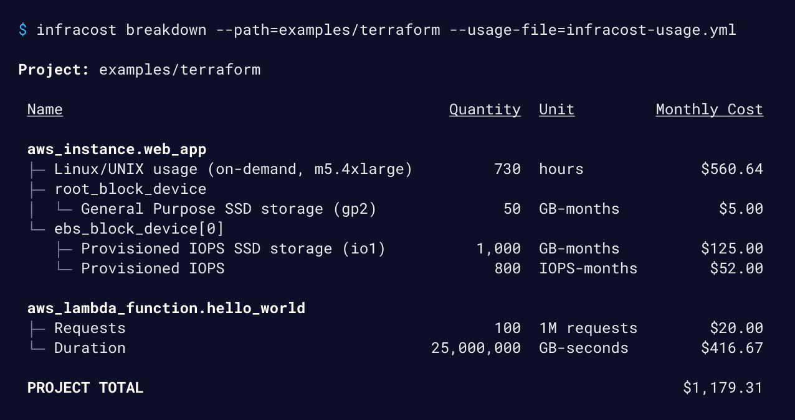
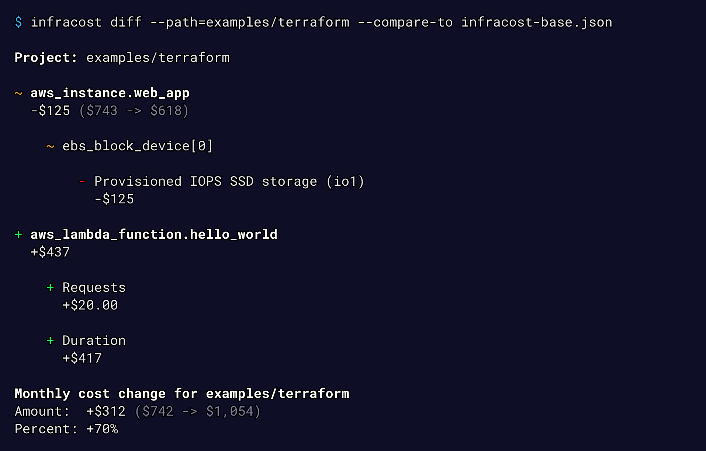
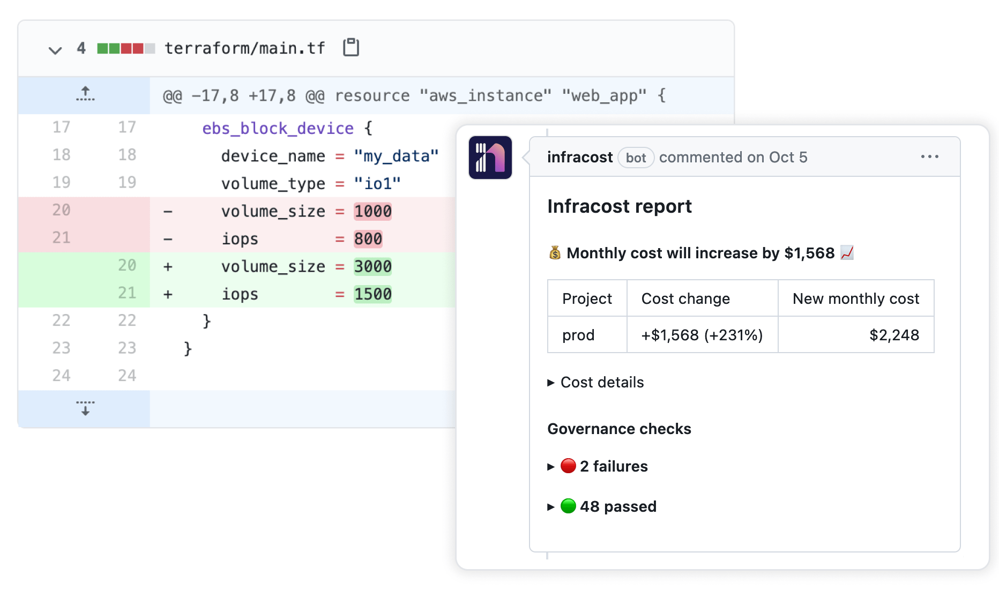

<p align="center">
<a href="https://www.c3x.dev"></a>

<p align="center">Cloud cost estimation with built-in optimization recommendations, budget guardrails, what-if analysis, and fully offline mode — no API key required.</p>
</p>
<p align="center">
<a href="https://www.c3x.dev/docs/"></a>

<a href="https://www.c3x.dev/community-chat"></a>
</p>

## Get started

```sh
# macOS / Linux
brew install c3xdev/tap/c3x

# Docker
docker pull c3xdev/c3x

# Or download from GitHub Releases
# https://github.com/c3xdev/c3x/releases
```

```sh
c3x estimate --path /path/to/terraform
```

See our [**quick start guide**](https://www.c3x.dev/docs/#quick-start) for more details.

## What makes C3X different

### Cost optimization recommendations

C3X doesn't just show costs — it suggests how to save money.

```sh
c3x recommend --path .
# Or inline with estimate:
c3x estimate --path . --recommend
```

```
3 recommendation(s) found:

  1. Upgrade to newer instance generation (m5.xlarge -> m7i.xlarge)
     Resource: aws_instance.web (aws_instance)
     The m7i family has better price-performance than m5.

  2. Switch EBS volume from gp2 to gp3
     Resource: aws_ebs_volume.data (aws_ebs_volume)
     gp3 volumes are up to 20% cheaper with better baseline performance.

  3. Consider VPC endpoints to reduce NAT Gateway costs
     Resource: aws_nat_gateway.main (aws_nat_gateway)
     NAT Gateway charges $0.045/GB. VPC endpoints can eliminate these charges.
```

### Budget guardrails in CI/CD

Enforce cost limits in your pipeline — no paid subscription required.

```sh
# Fail the pipeline if monthly cost exceeds $1,000
c3x estimate --path . --budget 1000

# Fail if cost increases more than 20%
c3x diff --path . --compare-to baseline.json --budget-increase 20
```

### What-if cost scenarios

Explore cost impact of changes without modifying Terraform code.

```sh
# What if we use a bigger instance?
c3x estimate --path . --what-if 'aws_instance.web.instance_type=m6i.8xlarge'

# What if we enable multi-AZ?
c3x estimate --path . --what-if 'aws_db_instance.main.multi_az=true'
```

### Fully offline mode

Download pricing data once, estimate forever. No network calls, no telemetry, no API key.

```sh
# Download pricing data (~50MB)
c3x pricing sync --providers aws,azure

# Estimate without any network calls
c3x estimate --path . --offline
```

### Self-hosted pricing API

C3X includes an independent pricing API that scrapes directly from AWS, Azure, and GCP public pricing APIs. Run it yourself for complete independence.

```sh
export C3X_SELF_HOSTED=true
export C3X_PRICING_API_ENDPOINT=http://localhost:4000
c3x estimate --path .
```

## Core features

### Cost estimates in your terminal

```
c3x estimate --path /code
```



### Cost diffs before you deploy

```
c3x diff --path /code --compare-to baseline.json
```



### PR comments in CI/CD

Post cost estimates automatically in pull requests. Works with GitHub Actions, GitLab CI, Bitbucket Pipelines, Azure Pipelines, Atlantis, and Spacelift.



## Supported clouds and resources

C3X supports over **1,100** Terraform resources across [AWS](https://www.c3x.dev/docs/supported_resources/aws), [Azure](https://www.c3x.dev/docs/supported_resources/azure), and [Google Cloud](https://www.c3x.dev/docs/supported_resources/google).

C3X can also estimate [usage-based resources](https://www.c3x.dev/docs/usage_based_resources) such as AWS S3, Lambda, and data transfer.

## Roadmap

- **Compare to real cloud bills** — Validate estimates against AWS Cost Explorer / Azure Cost Management
- **More IaC support** — Pulumi, AWS CDK, Azure Bicep
- **Historical cost tracking** — Cost trends across commits and PRs
- **IDE extensions** — VS Code, JetBrains inline cost estimates

## Community

Join our [community Slack channel](https://www.c3x.dev/community-chat) to learn more about cost estimation, ask questions, and connect with other users and contributors.

## Contributing

We welcome contributions big and small. Please start by opening a thread in [GitHub Discussions](https://github.com/c3xdev/c3x/discussions) before submitting a PR. See our [contribution guide](CONTRIBUTING.md) for details.

## License

[Apache License 2.0](https://choosealicense.com/licenses/apache-2.0/)
